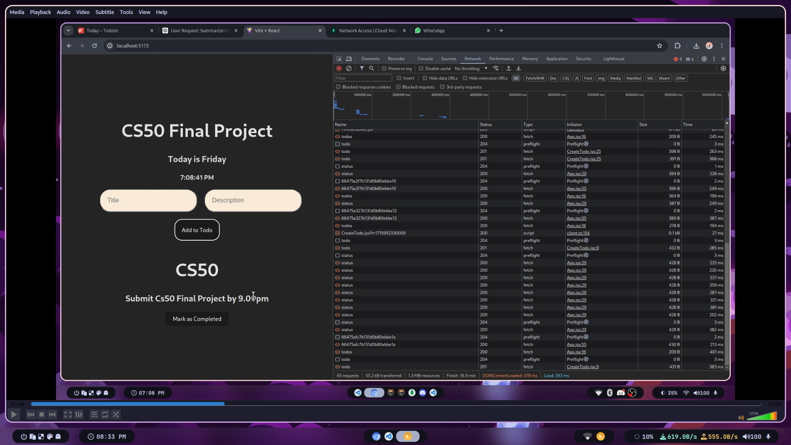
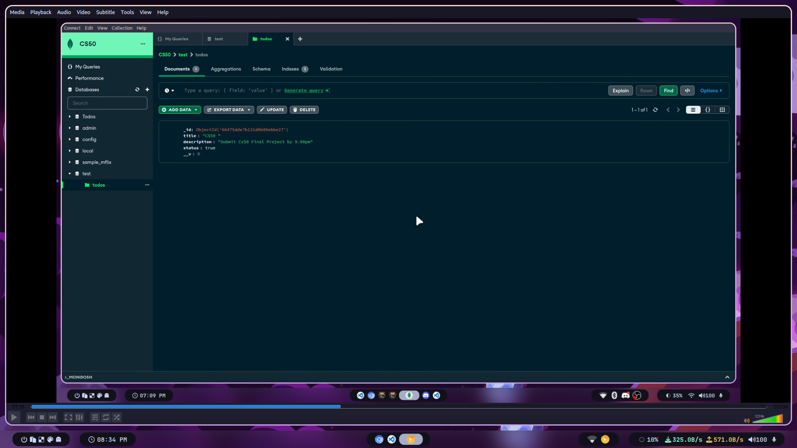
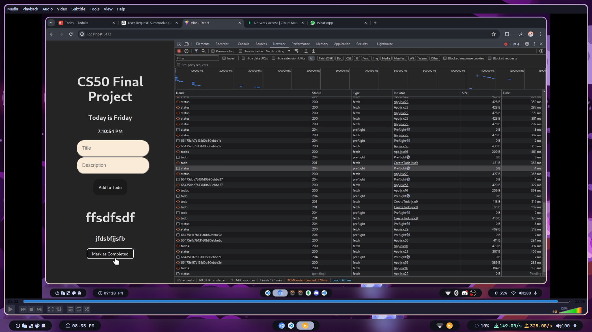

# Todo Application
>This was my final project for conclude the CS50 Introduction to Computer Sciense course.

## Overview

This is a full-stack Todo Application that allows users to create tasks, update their progress, mark them as completed, and delete completed tasks. The application utilizes Express for the backend, Zod for validation, and Mongoose for database management.

## Features

- **Create Todo:** Users can create new tasks with a title and description.
- **Update Progress:** Tasks can be updated to mark their progress.
- **Mark as Completed:** Users can mark tasks as completed.
- **Delete Completed Tasks:** Completed tasks can be deleted from the list.

## Technologies Used

- **Express:** Used for building the backend server.
- **Zod Validation:** Ensures data integrity and validation of input.
- **Mongoose:** Provides MongoDB object modeling for Node.js.
- **React:** Used for building the frontend user interface.
- **HTML/CSS:** Used for styling and structuring the frontend components.

- 
 ## Pictures
- Login and Adopt page

  

- Mongodb




- Responsive Web
|  

## Demonstration on youtube
For the CS50 final project you have to make a video showning your project,
[My Final Project presentation]()

## Installation

1. Clone the repository:

    ```bash
    git clone <repository-url>
    ```

2. Install dependencies:

    ```bash
    cd todo-application
    npm install
    ```

3. Start the development server:

    ```bash
    npm start
    ```

## Usage

1. Access the application through your web browser.
2. Create new tasks by providing a title and description.
3. Update the progress of tasks as needed.
4. Mark tasks as completed once finished.
5. Delete completed tasks when no longer needed.

## License

This project is licensed under the MIT License - see the [LICENSE](LICENSE) file for details.
